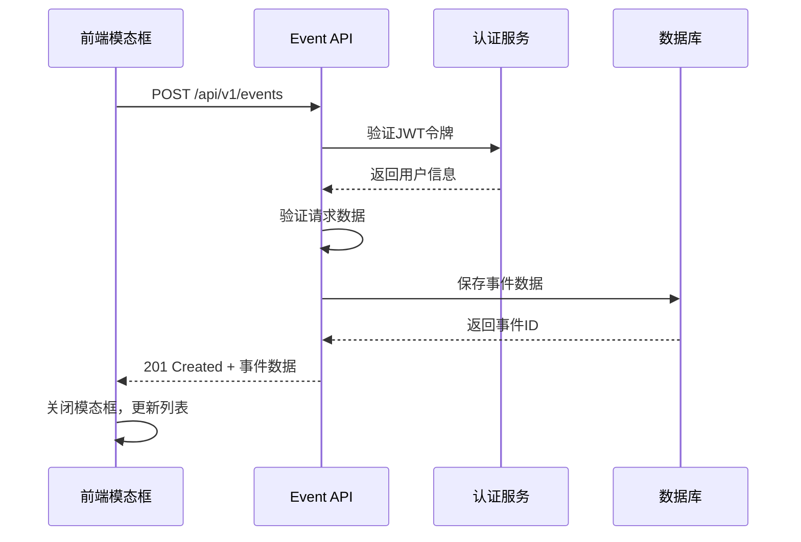

# 事件创建API需求文档

## 📋 项目信息
- **项目名称**: MeetlyOmni - 全栈会员活动管理系统
- **需求编号**: T9-Backend: Event Creation API
- **GitHub Issue**: [#49](https://github.com/JR26-P3-MeetlyOmni/meetlyomni-backend/issues/49)
- **创建日期**: 2025-01-27
- **优先级**: 高

## 🎯 业务目标

### 用户故事
> 作为活动管理页面的创建者，  
> 我希望通过简单的后端API创建新事件，  
> 以便前端模态框可以持久化事件数据而无需离开页面。

### 核心功能
- 支持事件创建（草稿/发布状态）
- 完整的请求/响应模式
- 数据验证和认证
- 数据库持久化

## 🔧 技术规格

### API端点
```
POST /api/v1/events
```

### 认证要求
- **类型**: JWT Bearer Token / HTTP-only Cookies
- **必需**: 是
- **权限**: 已登录用户

### 请求体结构
```csharp
public class CreateEventRequest
{
    [Required] 
    public Guid OrgId { get; set; }
    
    [Required, StringLength(255)]
    public string Title { get; set; } = default!;
    
    [StringLength(500)]
    public string? Description { get; set; }
    
    public string? CoverImageUrl { get; set; }
    
    [StringLength(255)] 
    public string? Location { get; set; }
    
    [StringLength(10)] 
    public string? Language { get; set; } = "en";
    
    public EventStatus Status { get; set; } = EventStatus.Draft;
}
```

### 响应结构
```csharp
public class CreateEventResponse
{
    public Guid EventId { get; set; }
    public Guid OrgId { get; set; }
    public string Title { get; set; } = default!;
    public string? Description { get; set; }
    public string? CoverImageUrl { get; set; }
    public string? Location { get; set; }
    public string? Language { get; set; }
    public EventStatus Status { get; set; }
    public string? CreatedByName { get; set; }
    public string? CreatedByAvatar { get; set; }
    public DateTimeOffset CreatedAt { get; set; }
    public DateTimeOffset UpdatedAt { get; set; }
}
```

## ✅ 验证规则

### 必填字段
- `OrgId`: 组织机构ID（Guid格式）
- `Title`: 事件标题（1-255字符，去除空格）

### 可选字段验证
- `Description`: 最多500字符
- `Location`: 最多255字符
- `Language`: 最多10字符，默认"en"
- `CoverImageUrl`: URL格式验证
- （创建接口已隐藏）StartTime/EndTime 不在创建请求/响应中出现

### 业务规则
- 事件默认创建为`Draft`状态
- 创建者ID从认证上下文获取，忽略客户端发送
- 时间戳使用UTC格式存储
- 支持"保存为草稿"和"保存并发布"功能

## 📊 响应状态码

| 状态码 | 描述 | 响应体 |
|--------|------|--------|
| 201 Created | 成功创建事件 | CreateEventResponse |
| 400 Bad Request | 无效请求体 | ValidationProblemDetails |
| 401 Unauthorized | 未认证 | ProblemDetails |
| 422 Unprocessable Entity | 业务规则验证失败 | ProblemDetails |
| 5xx | 服务器错误 | ProblemDetails |

## 🔐 安全要求

### 认证与授权
- 使用JWT令牌或HTTP-only Cookie认证
- 从认证上下文获取用户ID作为创建者
- 验证用户对指定组织的访问权限

### 数据安全
- 忽略客户端发送的创建者信息
- 只返回非敏感的创建者信息（姓名、头像）
- 输入数据清理和验证

## 🧪 测试要求

### 单元测试
- ✅ 有效请求且已认证 → 201 Created
- ❌ 未认证请求 → 401 Unauthorized
- ❌ 无效请求体 → 400 Bad Request
- ❌ 业务规则违反 → 422 Unprocessable Entity

### 集成测试
- 数据库持久化验证
- 认证中间件集成
- 错误处理验证

## 🔄 业务流程



## 📁 文件结构

```
meetlyomni-backend/src/MeetlyOmni.Api/
├── Controllers/
│   └── EventController.cs (新增)
├── Models/
│   └── Event/
│       ├── CreateEventRequest.cs (新增)
│       └── CreateEventResponse.cs (新增)
├── Services/
│   └── EventService/
│       ├── IEventService.cs (新增)
│       └── EventService.cs (新增)
└── Data/
    └── Repository/
        └── IEventRepository.cs (新增)
```

## 🚀 实现计划

### 阶段1: 基础结构
1. 创建DTO模型
2. 实现EventController
3. 添加基础验证

### 阶段2: 业务逻辑
1. 实现EventService
2. 添加数据验证
3. 实现数据库操作

### 阶段3: 测试与优化
1. 编写单元测试
2. 集成测试
3. 性能优化

## 📝 验收标准

- [ ] `POST /api/v1/events` 成功创建事件并返回201状态码
- [ ] 认证用户始终被设置为创建者（防止伪造）
- [ ] 无效请求返回400/422，未认证返回401
- [ ] 记录使用UTC时间戳持久化
- [ ] 单元/集成测试通过

## 🔗 相关依赖

- 前端需求: [#84: Event Management – Create Event Modal](https://github.com/JR26-P3-MeetlyOmni/meetlyomni-frontend/issues/84)
- 认证系统: JWT/Cookie认证已就绪
- 数据库: Events表迁移（如需要）

## 📚 参考文档

- [ASP.NET Core Web API 文档](https://docs.microsoft.com/en-us/aspnet/core/web-api/)
- [Entity Framework Core 文档](https://docs.microsoft.com/en-us/ef/core/)
- [JWT认证最佳实践](https://docs.microsoft.com/en-us/aspnet/core/security/authentication/jwt-authn)

---

**最后更新**: 2025-09-23  
**状态**: 部分实现（创建接口隐藏时间字段）  
**负责人**: RubyAtUsyd

